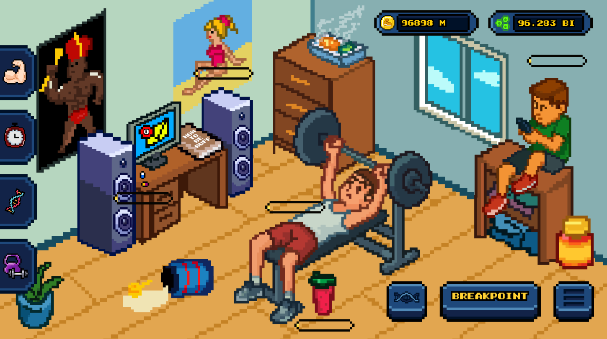

# NoClickNoGain

> A workout-themed idle/clicker game where you build the world's strongest 
> body one click at a time.

**▶ [Play it on itch.io](https://noclicknogain.itch.io/no-click-no-gain-demo)**

## About

NoClickNoGain is a workout-themed idle game where players grow from a 
struggling beginner to the strongest bodybuilder of the universe. Active 
clicking, idle income, and reset stages drive the 
progression loop, with skill upgrades letting players specialize in 
either active or passive playstyles.

The game was developed at Kriti Games as a small-team production. After 
the studio closed, I was given the opportunity to take over as Product Owner to continue development.

## My Role

- **Lead Game Designer & Game Developer** during studio production
- **Product Owner** post-closure, continuing development independently
- Owned core systems design: skill tree, prestige mechanics, currency 
  curves, and the active-vs-idle balance

## Design Highlights

- **Active vs. idle as a real choice** — most idle games eventually 
  collapse into pure-idle late game. NoClickNoGain layers active skills 
  with high cooldowns and short windows, so engaged players consistently 
  out-earn pure-idle players. The trade-off becomes a real player choice 
  rather than a forced grind.
- **Prestige resets as visual milestones** — each prestige reset visibly 
  transforms the gym environment, giving players a concrete sense of 
  progress beyond rising numbers.
- **Passive skills as balance levers** — passive skills connect to base 
  income skills, allowing fine-grained tuning of late-game pacing 
  without rebuilding the core loop.

## Built With

- Unity 6
- C#
- Unity UI Toolkit (UXML / USS)

## Status

Shipped to itch.io as a demo.

---

[LinkedIn](https://www.linkedin.com/in/mate-papp25/) | [Itch.io](https://pappmate25.itch.io/)
